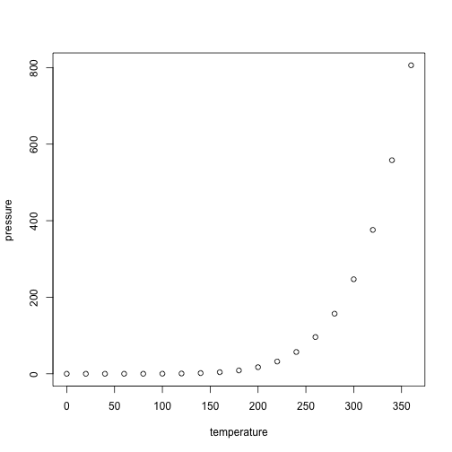

# Exponential Distribution Simulation Help

This tool allows use to quickly investigate the exponential distribution and compare it with the Central Limit Theorem (CLT). With the Central Limit Theorem, the rule states that the distribution of average of IID (Independant & Identically Distributed) variables, (when properly normalized), becomes that of a standard normal distribution.  This is more evident as the sample size increases.

## To Use this Tool:

This tool has a basic interface to allowing use to specify the parameters of the exponential distribution.  
You can modify the the parameters entered into the exponential formula and investigate the distribution of a large sampling of averages of groups (no of simulations). This tool has reactive interface so once your modify the parameters in the left panel, you will see some modifications to the summary view in the primary panel.

1. Use the slide to change the lambda rate used in the calculations.

2. Modify the number of exponentials in your experiments.

3. Modify the number of simulations that will be calculated for the primary simulation.

4. In the main panel on the right, toggle between the tabs/panes to see different results, plots and charts about the exponential distribution.

* * *

## Review of some of the parameters within the EDS Tool:

| Parameter          | Variable        | Value                      | Notes       |
|--------------------|---------------|------------------------------|--------------|
| Exponential Distribution | getExpDist | function(n, lambda) rexp(n,lambda) | See Param-Note 1 below |
| Mean  | getExpDistMean |function(lambda) 1/lambda  |   |
| Standard Deviation | getExpDistStdDev | function(lambda) 1/lambda|   |
| Rate Parameter | lambda | 0.2 | Default value |
| Observations Count | n | 40 | Default Value |
| Simulation Count | nosim | 1000 | Default Value |
| Theoretical Mean | expDistMean | getExpDistMean(lambda) = 5 | |

Param-Note 1: The expontential distribution can be simulated with this function *getExpDist*, where *lambda* is a rate parameter. We will pass in the number of exponentials we want to be calculated.


## R Markdown

This is an R Markdown document. Markdown is a simple formatting syntax for authoring HTML, PDF, and MS Word documents. For more details on using R Markdown see <http://rmarkdown.rstudio.com>.

When you click the **Knit** button a document will be generated that includes both content as well as the output of any embedded R code chunks within the document. You can embed an R code chunk like this:


```r
summary(cars)
```

```
##      speed           dist       
##  Min.   : 4.0   Min.   :  2.00  
##  1st Qu.:12.0   1st Qu.: 26.00  
##  Median :15.0   Median : 36.00  
##  Mean   :15.4   Mean   : 42.98  
##  3rd Qu.:19.0   3rd Qu.: 56.00  
##  Max.   :25.0   Max.   :120.00
```

## Including Plots

You can also embed plots, for example:



Note that the `echo = FALSE` parameter was added to the code chunk to prevent printing of the R code that generated the plot.
